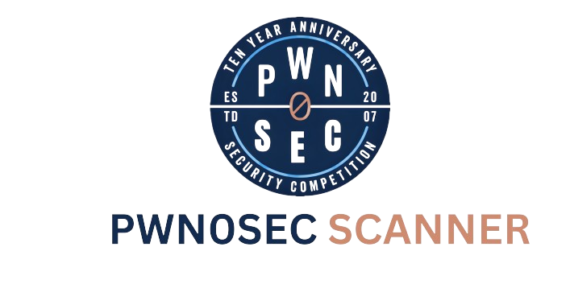
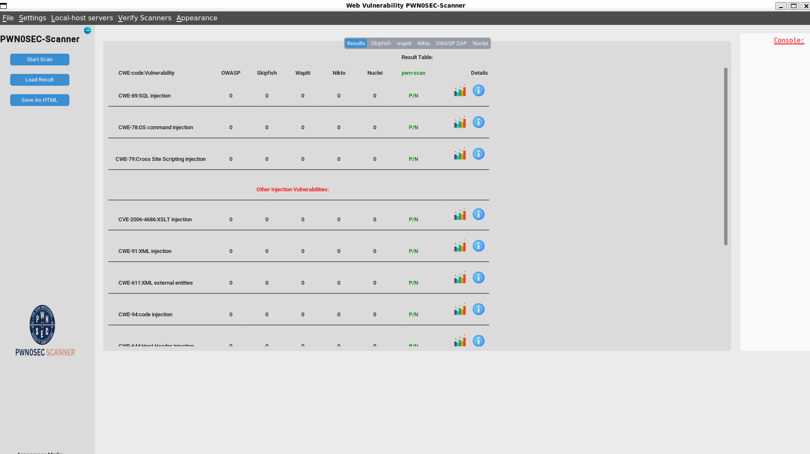
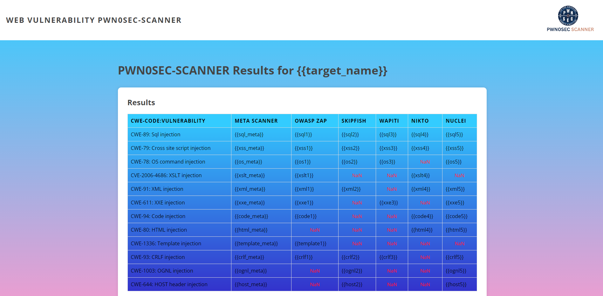

# PWN0SEC-PROJECT
Pemindai PWN0SEC-SCAN adalah pemindai kerentanan web/application komprehensif yang menggabungkan beberapa pemindai DAST, termasuk Nikto Scanner, OWASP ZAP, Nuclei, SkipFish, dan Wapiti.
 

Proyek ini bertujuan untuk membicarakan bidang Pengujian Keamanan Dinamis. Pemindai PWN0SEC-SCAN adalah pemindai kerentanan web komprehensif yang menggabungkan beberapa pemindaian DAST, termasuk Nikto Scanner, OWASP ZAP, Nuclei, SkipFish, dan Wapiti.

## Table of Contents

- [Introduction](#introduction)
- [Features](#features)
- [Installation](#installation)
- [Usage](#usage)
- [Contributing](#contributing)
- [License](#license)
- [ScreenShots](#ScreenShots)

## Introduction
Perangkat lunak ini menawarkan antarmuka grafis ramah pengguna yang menyajikan laporan komprehensif untuk setiap pemindaian, membuat proses pemindaian menjadi mudah dan mudah.
Fokus utama pemindaian ini adalah pada kerentanan injeksi web seperti injeksi SQL, injeksi XSS, injeksi perintah OS, injeksi XML, dan masih banyak lagi. Selain itu, ini memberikan daftar kerentanan yang didukung oleh setiap pemindaian, selain kerentanan injeksi.
Kami menawarkan dua jenis laporan. Yang pertama adalah laporan konsolidasi dalam format JSON, yang mencakup laporan penting dari setiap pemindaian. Ini berisi detail seperti kerentanan, URL terkait, parameter yang digunakan, perintah Curl, vektor serangan, deskripsi kerentanan, dan banyak lagi.
Laporan kedua adalah format file HTML yang secara khusus menyoroti serangan injeksi yang berhasil. Hasil dan keputusan kami didasarkan pada algoritma pembelajaran baru yang diusulkan selama ("Pendekatan berbasis PWN0SEC-SCAN untuk mendeteksi kerentanan injeksi dalam aplikasi Web.

## Features

List of Main Vulnerabilities supported:
1. Injection
  - SQL injection
  - Cross site scripting
  - OS command injection
  - XML injection
  - XSLT injection
  - XML External entites
  - code  injection
  - host header injection
  - html injection
  - Template injection (server-side)
  - CRLF injection
  - OGNL injection 
2. Other vulnerabilities (refer to the repository of each scanner for a complete list.)
  - Skipfish Vulnerabilities support List.
  - Wapiti Vulnerabilities support List.
  - OWASP ZAP Active Attack list.
  - Nikto Vulnerabilities support List (Specified: Tunning 9 & 4).
  - Nuclei CVE-Template.
## Installation

The installation process requires a specific set of requirements. While this project is primarily supported on Kali Linux, it can also be compatible with other operating systems:

1. OWASP zaproxy:
  - kaliLinux: [ sudo apt install zaproxy ]  
  - Other OSs: [ https://github.com/zaproxy/zaproxy ]
  
2. Wapiti:
  - kaliLinux: [ sudo apt install wapiti ]  
  - Other OSs: [ https://wapiti-scanner.github.io/ ]  
  
3. Skipfish:
  - kaliLinux: [ sudo apt install skipfish ]  
  - Other OSs: [ https://gitlab.com/kalilinux/packages/skipfish ]  
    
4. Nikto :
  - kaliLinux: [ sudo apt install nikto ]  
  - Other OSs: [ https://github.com/sullo/nikto ]  

5. Nuclei:
  - kaliLinux: [ sudo apt install nuclei ]  
  - Other OSs: [ https://github.com/projectdiscovery/nuclei ]  

6. Python 3 * Libraries:
  - customtkinter 
  - zapv2
  - jinja2
  - webbrowser
  - PIL
  - matplotlib
  - BeautifulSoup
  - pprint

7. optional requirments for more features:
  - XAMP server   
  - NPM  

(Note: Please note that I will be creating a bash script to automate the installation steps for Linux users as soon as possible.)

## Usage
Setelah mengkloning repositori ke mesin lokal Anda, Anda dapat memulai aplikasi dengan menjalankan perintah python3 Pwn0sec-Scan.py.
Kemudian, Anda dapat menavigasi antarmuka aplikasi.

## ScreenShots

